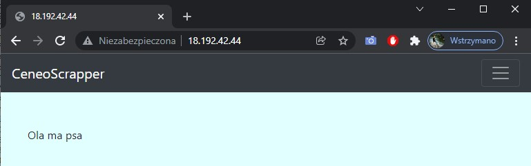
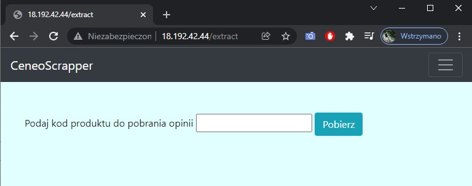

# **Automatyczna instalacja aplikacji + serwera proxy**
### Cały proces składa się z kilku kroków zawartych w pliku ***setup_fa.yaml*** podzielonych na dwie części: konfigurację aplikacji Flask i konfigurację serwera proxy.
- ### Konfiguracja aplikacji (flaskapp_node)
    - ### `install os packages` - instalacja paczek takich jak python3, python3-pip czy git.
    - ### `sync repo` - pobieranie podlinkowanego repozytorium i umieszczanie go w odpowiednim miejscu ***/opt/ExampleApp***
    - ### `app user` - tworzenie linuxowego użytkownika
    - ### `change permissions` - zmiana uprawnień
    - ### `venv for python + requirements` - utworzenie środowiska wirtualnego
    - ### `register as a service` - wstawienie pliku z konfiguracją w odpowiednie miejsce na serwerze
    - ### `start service` - uruchomienie aplikacji 
- ### Konfiguracja serwera proxy (load_balancer)
    - ### **app_ips: 172.31.28.223:8080** - prywatny adres IP i port serwera na którym znajduje się nasza aplikacja Flask
    - ### `install epel` - instalacja paczek EPEL
    - ### `install nginx` - instalacja serwera NGINX
    - ### `put nginx conf` - wstawienie configuracji NGINX w odpowiednie miejsce
    - ### `reload nginx` - przeładowanie NGINXa
### W pliku ***hosts.ini*** uzupełniamy pola `[flaskapp_node]` i `[load_balancer]` odpowiednimi adresami IP i wykonujemy polecenie **`ansible-playbook -i hosts.ini setup_fa.yaml`** po całym procesie instalicji po wspianiu adresu IP serwera proxy w dowolną przeglądarkę ukaże nam się nasza aplikacja.

## **Infrastruktura sieciowa:**
- ### Maszyna z aplikacja:
    - ### Publiczny adres IP: 18.185.149.212
    - ### Prywatny adres IP: 172.31.28.223
- ### Serwer proxy:
    - ### Publiczny adres IP: 18.192.42.44
    - ### Prywatny adres IP: 172.31.21.20
### Wszystkie połączenia z serwerem proxy przekierowywane są na serwer z uruchomiona naszą aplikacja Flask na adres 172.31.28.223 do portu 8080.

